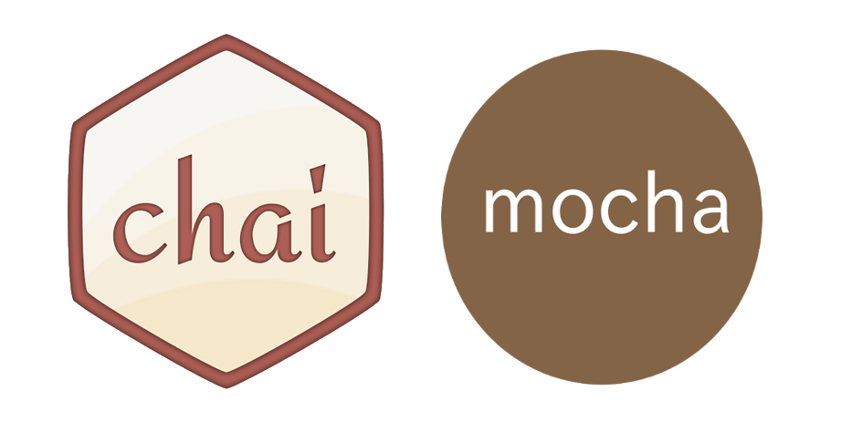

#  API Automation Testing with Mocha & Chai



> Mocha is a feature-rich JavaScript test framework running on Node.js and in the browser, making asynchronous testing simple and fun. https://mochajs.org

> Chai is a BDD / TDD assertion library for node and the browser that can be delightfully paired with any javascript testing framework. https://www.chaijs.com

---

### Prerequisites:

- Node.js
- VScode or other Text Editor.

### Get Started:
Clone this project repository into your local:
```sh
$ git clone https://github.com/dudiadikaryaa/mocha-chai-api.git
```

After you have successfully cloned this project repository, do the following:

```sh
$ cp env.sample .env
$ npm install
```

### How to Run:

```sh
$ npm run test-api-win                              | to run all tests (Windows)
$ npm run test-api-win -- --grep @tag               | to run test with specific tag (Windows)

$ npm run test-api                                  | to run all tests (Mac)
$ npm run test-api -- --grep @tag                   | to run test with specific tag (Mac)

$ npm run reports                                   | to generate mochawesome report
```

### How does it work?
For the detail explanation, please go [here](docs/details.md) !

### References:
- https://medium.com/@fadlymahendra/api-test-automation-menggunakan-mocha-chai-22a78c48e842
- https://blog.usejournal.com/https-medium-com-thisisabdus-automated-testing-with-mocha-beginners-guide-for-testing-javascript-apps-45aa67dc3352
